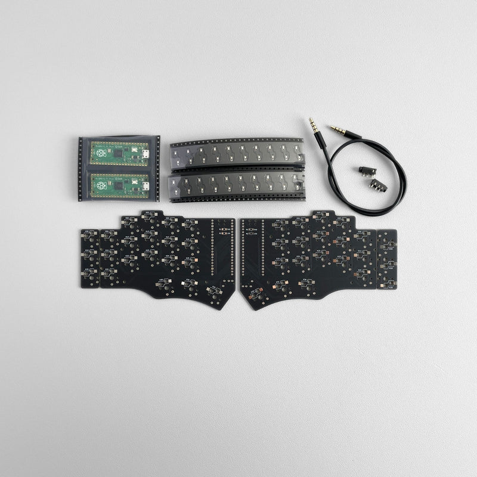

Welcome to my corner of the internet. My name is Joel and I am a system developer from Sweden.

I made this blog to document different projects I'm working on both because it is fun to share but also for myself as a journal that I can look back on in the future.

I have many different hobbies but mainly I like computers and software related to the cloud and container space. I like woodworking and have a workshop to build things in, which I will talk a bit about in my next blog post. Another interest I have is that I am planning on getting into electronics and soldering by building the Piantor keyboard kit I bought a couple of years ago.

---

I dont have really have any plans on what I want to build. I just like the process of finding something I like and the problem solving to complete the project, learning as I go.

If you find this interesting you're welcome to follow me on my journey. You could bookmark this page or follow it using a RSS reader of your choice. Perhaps you can learn something from my projects aswell.

// Joel
